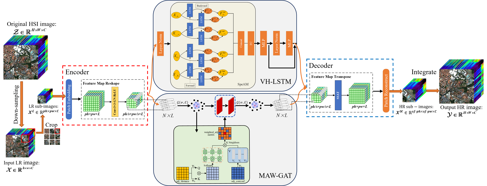
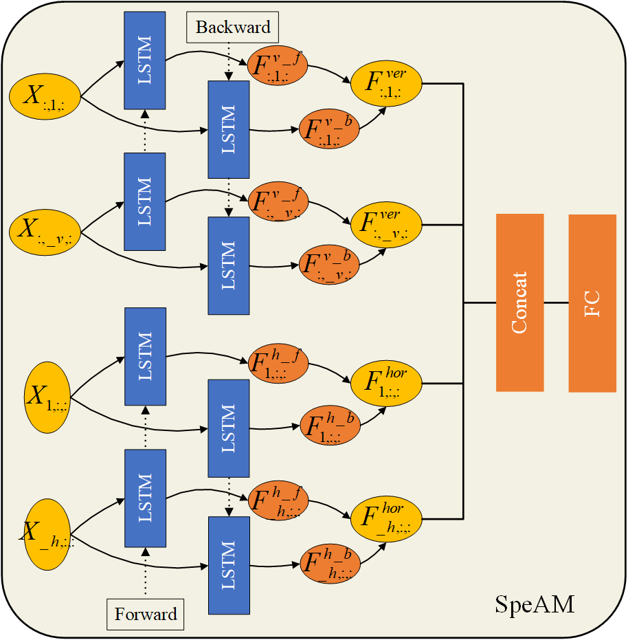
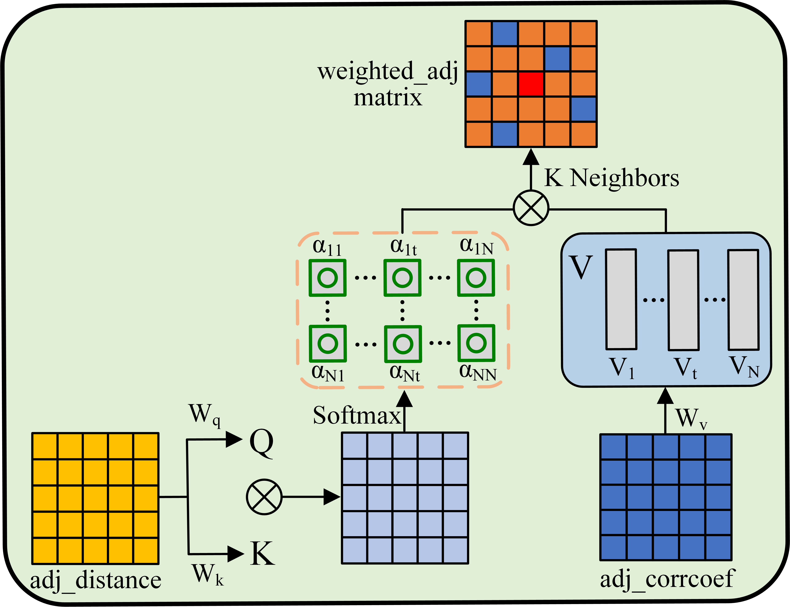
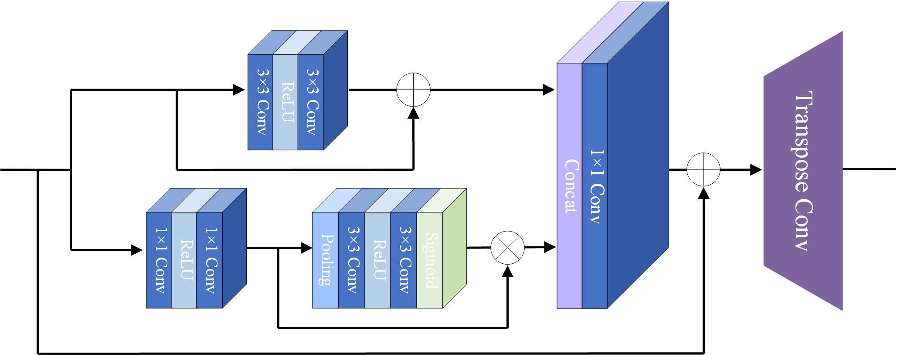

# SRLSGAT

Implementation of Hyperspectral Image Super-Resolution via Joint Network with Spectral-Spatial Strategy (SRLSGAT) [Paper Address](https://doi.org/10.1080/10095020.2025.2522909) in Pytorch. [Paper PDF Download](https://github.com/Dongyx1128/SRLSGAT/raw/main/SRLSGAT-Dongyx1128.pdf).


Hyperspectral image (HSI) super-resolution (SR) faces significant challenges due to the inherent difficulty in acquiring large-scale training data and the complex spectral-spatial relationships in HSIs that conventional deep-learning-based methods often fail to fully exploit. While existing approaches typically stack convolutional layers to increase network depth, they frequently overlook the structured continuity of spectral bands and non-local spatial similarities, resulting in limited performance and overfitting risks. To address these limitations, we propose SRLSGAT, a novel joint spectral-spatial network that combines a vertical-horizontal bi-directional LSTM (VH-BiLSTM) for modeling multi-directional spectral correlations and a multi-adjacent weight matrix graph attention network (MAW-GAT) for capturing non-local patch relationships. Besides, we design a spectral attention mechanism (SpeAM), which dynamically weights remote dependencies through bidirectional spectral sequence analysis, while the graph-based spatial processing adaptively learns patch similarities through optimized edge connections. Extensive experiments on three HSI datasets show that SRLSGAT has better performance relative to SOTA SR methods.


## Network Architecture
- The overall network architecture of our proposed SRLSGAT network

   

- Joint Spectral-Spatial Network

  - The Vertical-Horizontal Bi-directional LSTM (VH-BiLSTM)

    

  - The Multi-Adjacent Weight Matrix Graph Attention Network (MAW-GAT)

    

- The Spectral Attention Mechanism (SpeAM)

    

## Dependencies

```
cuda==11.4
numpy==1.15.0
python==2.6.1
scipy==1.1.0
tensorboard==2.0.2
tensorboardX==2.4
thop==0.1.0.post2206102148
torch==1.7.1
torchvision==0.8.2
visdom==0.1.8.9
```

## Installation&Run
- Clone this repo:
```bash
git clone https://github.com/Dongyx1128/SRLSGAT
cd SRLSGAT
```

- Train the model
```bash
sh train.sh
```

- Test the model
```bash
sh test.sh
```

## Citation
```
@article{dyx2025SRLSGAT,
author = {Yaxin Dong and Bo Yang and Cong Liu and Zemin Geng and Taiping Wang},
title = {Hyperspectral image super-resolution via joint network with spectral-spatial strategy},
journal = {Geo-spatial Information Science},
volume = {0},
number = {0},
pages = {1-19},
year  = {2025},
publisher = {Taylor \& Francis},
doi = {10.1080/10095020.2025.2522909},
URL = {https://doi.org/10.1080/10095020.2025.2522909},
eprint = {https://doi.org/10.1080/10095020.2025.2522909},
}
```

```
[1] Dong, Yaxin, Bo Yang, Cong Liu, Zemin Geng, and Taiping Wang. 2025. “Hyperspectral Image Super-Resolution via Joint Network with Spectral-Spatial Strategy.” Geo-Spatial Information Science, July, 1–19. doi:10.1080/10095020.2025.2522909.
```

## Acknowledgments
This research was funded by the National Key Research and Development Program of China (No.2023YFD2201702).
